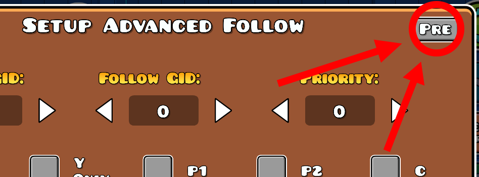
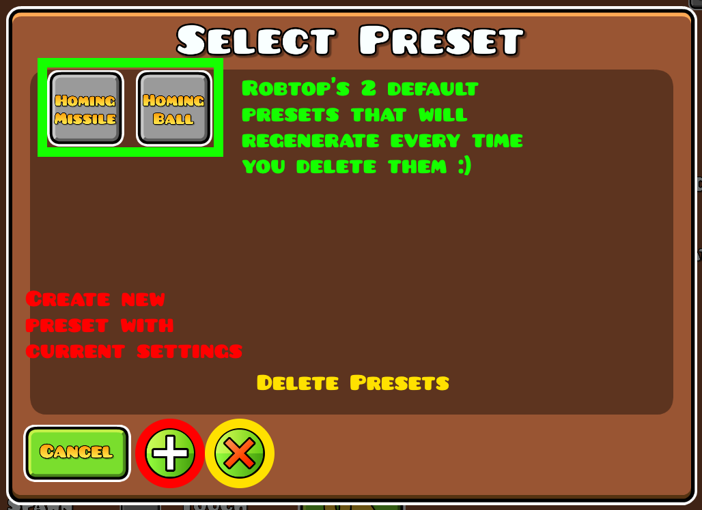
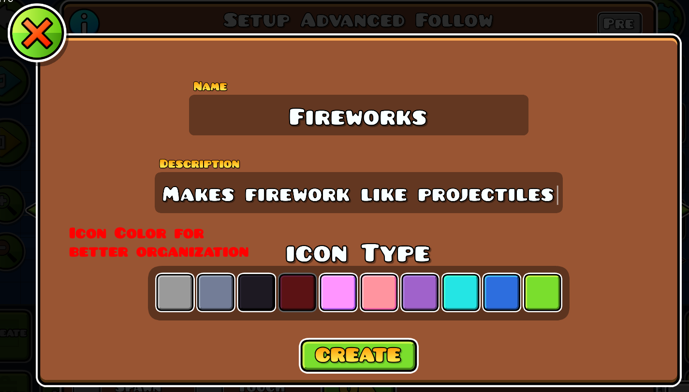
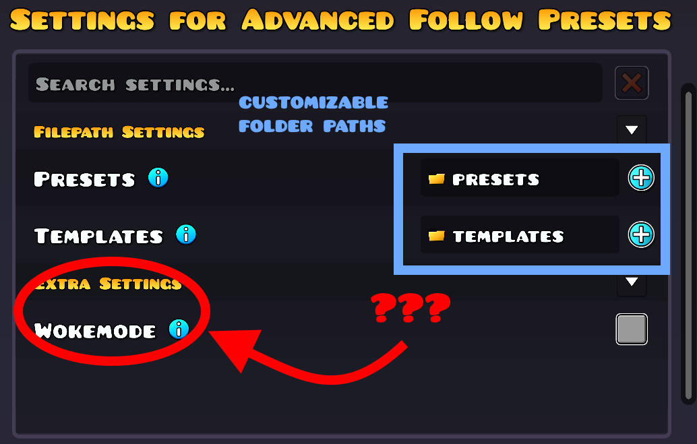

# Advanced Follow Presets
Tired of having to redo the same advanced follow triggers over and over? Premade settings just not doing it for you? Well look no further.
This mod is an overhaul for advanced follow premade settings.

## How to use
Advanced Follow Presets adds more functionality to that nifty little window in the top right corner of the advanced follow trigger.

## Extras
This mod also comes with customizable folder paths, a template (for scripting), and wokemode.

